# ツール作成の例

ツール作成は「デザイン」画面で行います。以下がその画像です：

<figure>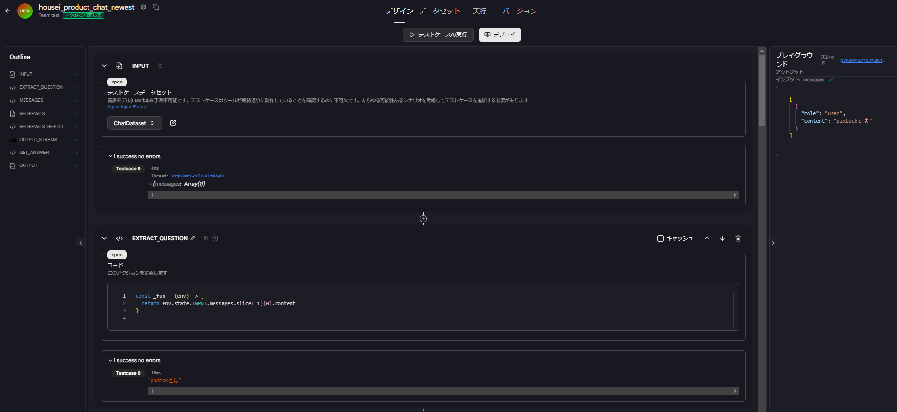</figure>

このツールは`INPUT`、`EXTRACT_QUESTION`、`MESSAGES`、`RETRIEVALS`、`RETRIEVALS＿RESULT`、`OUTPUT_STREAM`、`GET_ANSWER`、`OUTPUT`の８つのブロックから構成されています。

- `INPUT`はツールを作成する上で必須で、ここではユーザーの質問を JSON 形式に変換するブロックです。

<figure>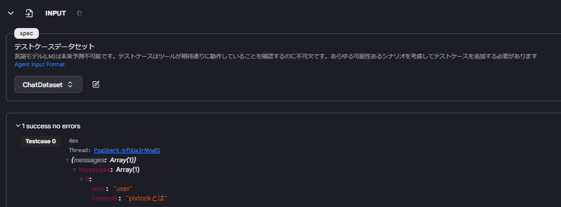</figure>

- `EXTRACT_QUESTION`はアクションの 1 つである`Code`を使用して`INPUT`の content を取得するブロックです。

<figure>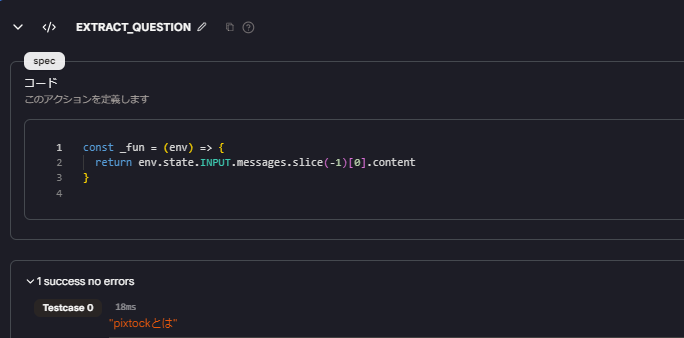</figure>

- `MESSAGES`はアクションの 1 つである`Code`を使用して`INPUT`の messages をマッピングして role と content を返すブロックです。

<figure>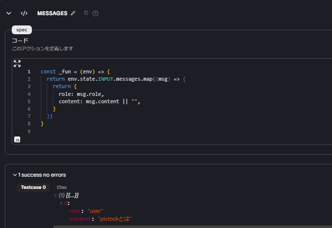</figure>

- `RETRIEVALS`はアクションの 1 つである`Knowledge Serach`を使用してナレッジデータベース検索するブロックです。ここではクエリとして`EXTRACT_QUESTION`を使用しています。

<figure>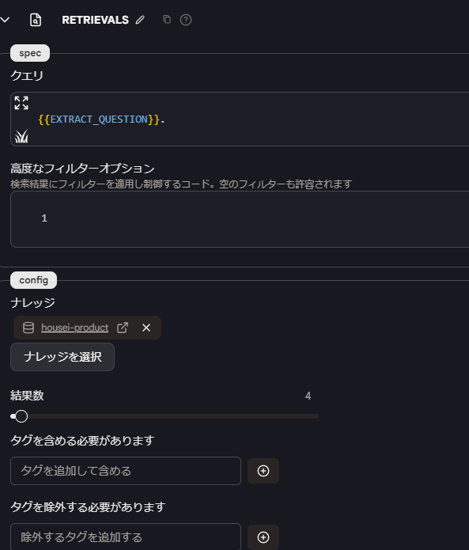</figure>

ここの部分ではメタデータが付与されるので、そのメタデータをダウンストリームアクションで使用できます。

<figure>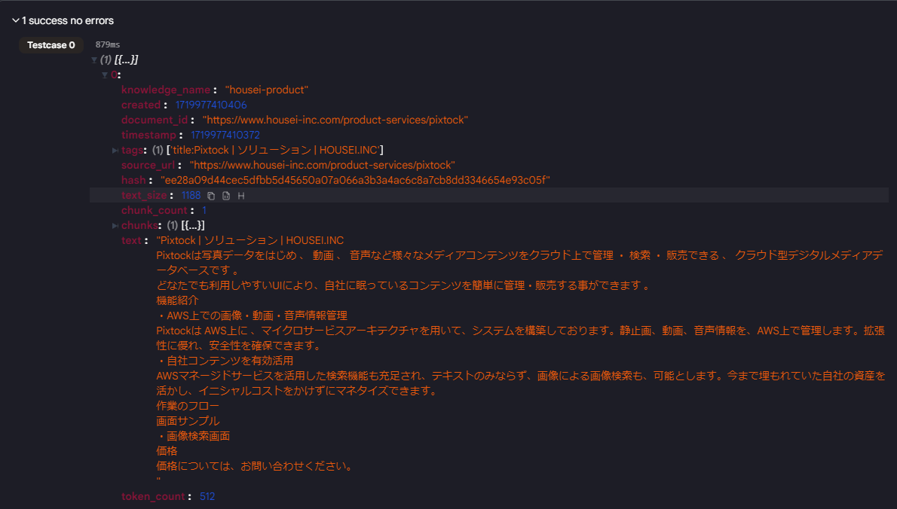</figure>

- `RETRIEVALS＿RESULT`はアクションの 1 つである`Code`を使用して`RETRIEVALS`の document_id と chunk.text を取得し整形して返すブロックです。document_id を使用することで参照元を表示させることできます。

<figure>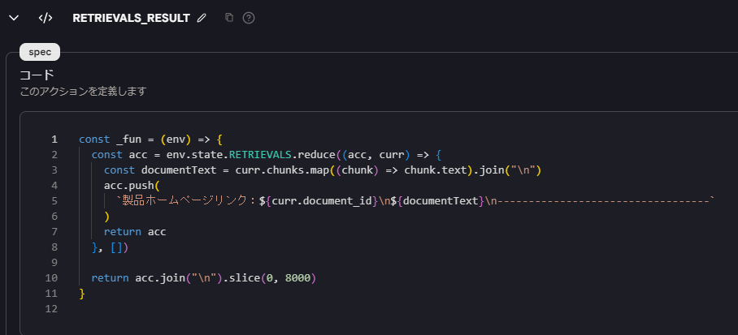</figure>

<figure>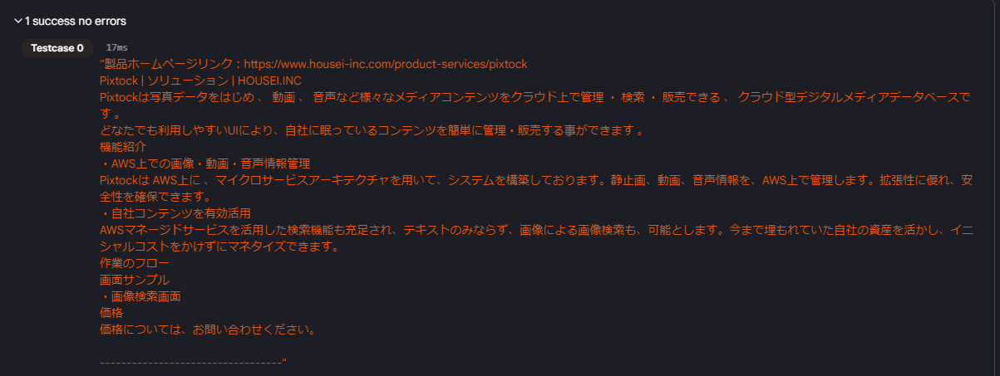</figure>

- `OUTPUT_STREAM`はアクションの 1 つである`Language Model Chat Interface`を使用しています。ここでは`RETRIEVALS＿RESULT`の情報に基づいて model に指示(プロンプト)をだし、そのプロンプトを system の content として，回答を assistant の content として`INPUT`に追加するブロックです。

<figure>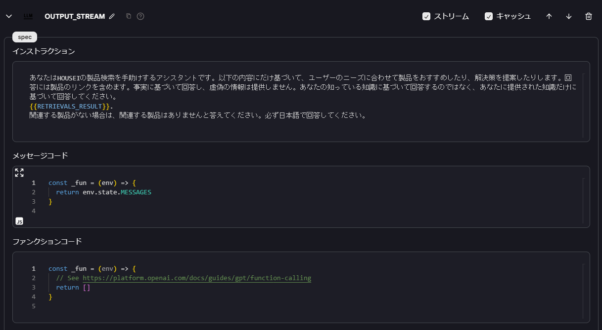</figure>

<figure>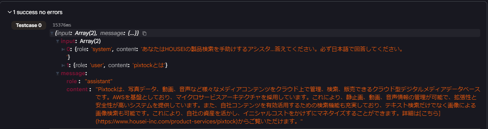</figure>

- `GET_ANSWER`はアクションの 1 つである`Code`を使用して`OUTPUT_STREAM`の role の assistant とその content を返すブロックです。

<figure>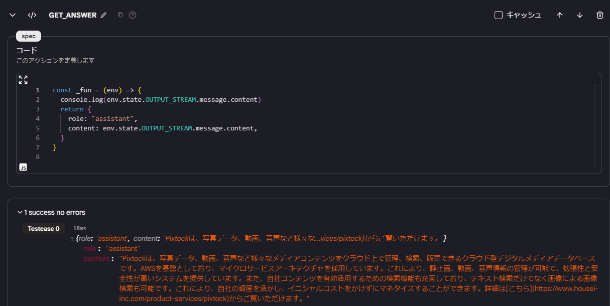</figure>

- `OUTPUT`は必須で、ここで`GET_ANSWER`の内容を受け取ります。

<figure>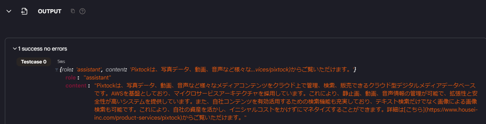</figure>

最終的に`OUTPUT`の content がユーザーへの回答になります。
